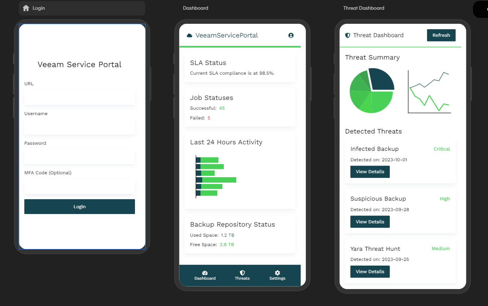

# Veeam Service Portal App

### Overview
This project is for the Veeam Hackathon 2024. It is a mobile application designed for customers of Veeam Service Providers to gain insights into their managed backups and private cloud resources. The app utilizes Veeam VSPC APIs to populate data and provide a comprehensive dashboard for users.

### Features
- **Login Screen**: Allows users to log in as either a regular user or a service provider.
- **Dashboard**: Displays backup performance, SLA status, job statuses, and repository status.
- **Billing Dashboard**: Provides insights into storage quota usage, licenses usage, and monthly billing.
- **Service Provider Dashboard**: Shows data protection by customer and customer overview.
- **Threat Center**: Displays detected threats and their details.

### Prerequisites
- Node.js
- Expo CLI

### Installation
1. **Clone the repository**:
    ```sh
    git clone [https://github.com/VeeamCommunity/veeamcommunity-2024-Team-4.git]
    cd veeamcommunity-2024-Team-4
    ```

2. **Install dependencies**:
    ```sh
    npm install
    ```

3. **Start the Expo server**:
    ```sh
    npx expo start
    ```

### Configuration
1. **API Configuration**:
    - Ensure you have access to Veeam VSPC APIs.
    - Update the API endpoints and authentication details in the relevant components.

### Running the App
1. **Start the Expo server**:
    ```sh
    npx expo start
    ```
2. **Open the app**:
    - Use the Expo Go app on your mobile device to scan the QR code provided by the Expo server.
    - Alternatively, you can run the app on an Android or iOS emulator.

### Testing
- **Manual Testing**:
    - Navigate through the app to ensure all screens and functionalities are working as expected.
    - Verify data is being fetched correctly from the Veeam VSPC APIs.

### Project Structure
- **App.js**: Entry point of the application.
- **Navigation.js**: Handles navigation between different screens.
- **LoginScreen.js**: Login screen for users.
- **DashboardScreen.js**: Main dashboard for regular users.
- **BillingDashboardScreen.js**: Billing dashboard screen.
- **ServiceProviderDashboardScreen.js**: Dashboard for service providers.
- **ThreatsScreen.js**: Displays detected threats.
- **SettingsScreen.js**: Placeholder for settings screen.
  
## 📗 Documentation
_Place documentation or links to documentation here._

### Screenshots


## ✍ Contributions

We welcome contributions from the community! We encourage you to create [issues](https://github.com/VeeamCommunity/veeamcommunity-2024-Team-4/issues/new/choose) for Bugs & Feature Requests and submit Pull Requests. For more detailed information, refer to our [Contributing Guide](CONTRIBUTING.md).

## 🤝🏾 License
* [MIT License](LICENSE)

## 🤔 Questions

If you have any questions or something is unclear, please don't hesitate to [create an issue](https://github.com/VeeamCommunity/veeamcommunity-2024-Team-4/issues/new/choose) and let us know!
